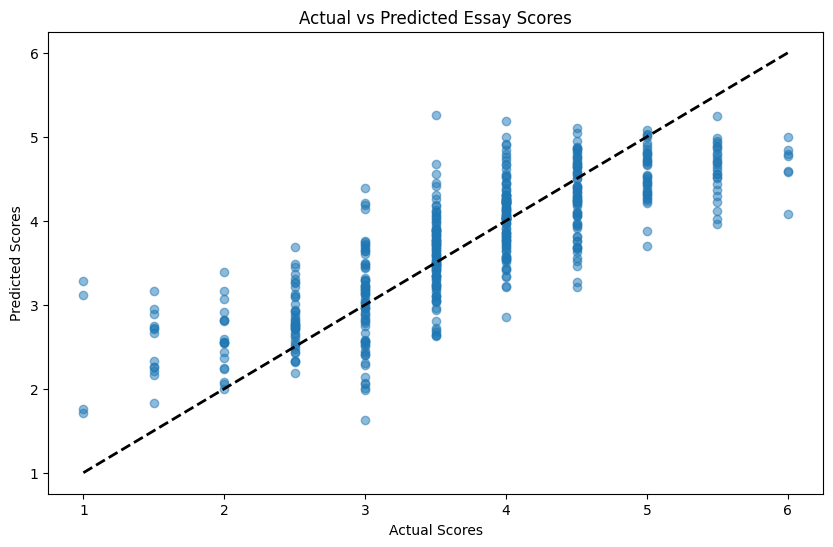

# course-portfolio
Portfolio Project 

# PROJECT TITLE 
Predicting writing quality from typing behaviour

## NON-TECHNICAL EXPLANATION OF YOUR PROJECT
This project is based on a Kaggle competition which ended on 9th January 2024. It aims to build a model that can effectively predict writing quality based on typing logs. More specifically, it predicts the scores of essays based on a large dataset of keystroke logs that have captured writing process features. It does this by first extracting a large additional number of features that relate to the typing process and then using a selection of these features to train a model that outputs scores on a scale of 0 - 6 when fed with typing logs of essays.

## DATA
The competition dataset comprises about 5000 logs of user inputs, such as keystrokes and mouse clicks, taken during the composition of an essay. Each essay was scored on a scale of 0 to 6. 

## MODEL 
I am using a Gradient Boosting Regressor model, which gave me the best results when compared to other models suited for this task such as Linear Regression, Random Forest Regressor, XGBoost, LightGBM, or SVR. 

## HYPERPARAMETER OPTIMSATION
My hyperparameters were: n_estimators, max_depth, min_samples_split, min_samples_leaf, max_features, subsample, loss. I performed hyperparameter optimisation using Optuna.

## RESULTS
I was able to achieve a RMSE of 0.577 which was not far away from the top RMSE of 0.570 on the Kaggle leaderboard at the time of writing. Note also that I only spent two weeks on the model, whereas the competition had been running for almost three months. 

You can include images of plots using the code below:

