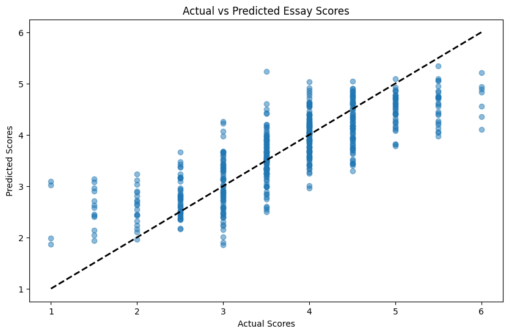

# course-portfolio
Portfolio Project 

# PROJECT TITLE 
Predicting writing quality from typing behaviour

## NON-TECHNICAL EXPLANATION OF YOUR PROJECT
This project is based on a Kaggle machine learning competition which ended on 9th January 2024 and aims to build a model that can effectively predict writing quality, or more specifically scores of essays, based on their typing logs. The basis of this is a large dataset of essay keystroke logs that have captured writing process features, along with the accompanying scores. From this, the model further extrapolates a large number of additional features that relate to the typing/writing process. The most advantageous selection of these features is then used to train the model to output corresponding scores on a scale of 0 - 6 with the maximum possible accuracy when fed with keystroke logs of essays.

## DATA
The competition training dataset comprises about 5000 logs of user inputs, such as keystrokes and mouse clicks, taken during the composition of an essay. Each essay was scored on a scale of 0 to 6. It can be found here, along with further details about its content and collection process: https://www.kaggle.com/competitions/linking-writing-processes-to-writing-quality/data

## MODEL 
I am using a Gradient Boosting Regressor model, which gave me the best results when compared to other models suited for this task such as Linear Regression, Random Forest Regressor, XGBoost, LightGBM, or SVR. 

## HYPERPARAMETER OPTIMISATION
My hyperparameters were: n_estimators, max_depth, min_samples_split, min_samples_leaf, max_features, subsample and loss. I performed hyperparameter optimisation using Optuna.

## RESULTS
I was able to achieve a RMSE of 0.595 on the test set. The top RMSE on the public Kaggle leaderboard was 0.570 at the time of writing; certainly room for improvement but promising that the model got below the 0.6 mark. Note also that I only was able to spend two weeks on the model, whereas the competition had been running for almost three months - with more time I could have doubtlessly further refined the model. 

I include a graph of the actual scores versus the model's predicted scores:

