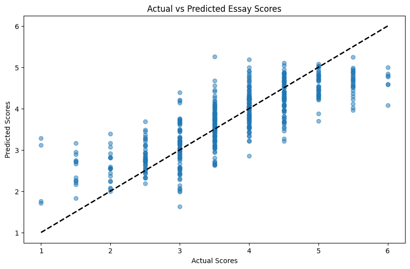

# Model Card

## Model Description

**Input:** 
The inputs are logs of user inputs, such as keystrokes and mouse clicks, taken during the composition of an essay.

**Output:**
The outputs are the corresponding essay scores, scored on a scale of 0 to 6.

**Model Architecture:** 
I have used a Gradient Boosting Regressor model with RFE feature selection.

## Performance

The model was trained on 80% of the available dataset and tested on the remaining 20%, delivering a RMSE of 0.577

## Limitations

The model requires the keystroke logs to be available in a certain format (that of the training logs provided), which is unlikely to always be the case. Furthermore, it requires substantial feature engineering of the original data. Since the feature engineering and training were based on the specific typing activities logged in the training dataset, the model is not particularly robust to unseen events. Another inherent bias to be aware of is that one of the specific rules of the writing task that was used to collect the training data was that participants should write an essay of at least 200 words in 3 paragraphs. Hence, the model may not be generalisable to essays of differing lengths/structure. It should certainly not be used for anything more than very general prediction and certainly not for the actual marking of typed essays.

## Trade-offs

The model performs solidly in the mid-range but tends to overpredict scores at the bottom of the range and underpredict scores at the top, as we can see from the following graph:

